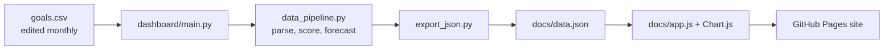

# FY27 Quantitative Core Goals Dashboard

An interactive, static dashboard that tracks the nine quantitative Core goals
and a weighted portfolio summary. A small Python pipeline turns the
hand-maintained `goals.csv` into `docs/data.json`; a no-build HTML/CSS/JS site
in `docs/` renders it with Chart.js and is hosted on GitHub Pages.

- Live site: https://cmalloy-premierinc.github.io/Goal_Dashboard/
- Repository: https://github.com/cmalloy-premierinc/Goal_Dashboard
- Hosting: GitHub Pages, branch `main`, folder `/docs`



## Contents

1. [Monthly update workflow](#monthly-update-workflow)
2. [Branching and local testing](#branching-and-local-testing)
3. [Project layout](#project-layout)
4. [Input: goals.csv](#input-goalscsv)
5. [Pipeline](#pipeline)
6. [Output: data.json](#output-datajson)
7. [Front end](#front-end)
8. [Configuration and common changes](#configuration-and-common-changes)
9. [Hosting and caching](#hosting-and-caching)
10. [Known limitations](#known-limitations)
11. [Troubleshooting](#troubleshooting)

## Monthly update workflow

1. Add this month's values to the month column in `goals.csv` (Jul through
   Jun). Leave future months blank.
2. Regenerate the data file from the repo root:
   ```powershell
   cd dashboard
   ..\.venv\Scripts\python.exe main.py
   ```
   This rewrites `docs/data.json`. Nothing else needs to change.
3. Optionally preview locally (see below).
4. Commit and push `goals.csv` and `docs/data.json` to `main`. GitHub Pages
   republishes within a minute or two.

Optional arguments: `main.py --csv <path> --out <path>`.

### One-time setup

```powershell
python -m venv .venv
.\.venv\Scripts\Activate.ps1
pip install -r dashboard\requirements.txt   # pandas, numpy
```

Git for Windows lives at `C:\Program Files\Git\cmd\git.exe`. It may not be on
`PATH` in every terminal; call it by full path if `git` is not found.

## Branching and local testing

- `main` is what GitHub Pages serves. Do not experiment on it.
- `testing` is the working branch for trying changes (`origin/testing`).
  Promote with a pull request
  (https://github.com/cmalloy-premierinc/Goal_Dashboard/pull/new/testing) or
  `git checkout main; git merge testing; git push`.
- Do monthly data updates on `main`, or merge `main` into `testing` first so
  the two `data.json` files do not drift.
- Pages only publishes `main`, so test locally:
  ```powershell
  cd docs
  python -m http.server 8765
  ```
  then open http://localhost:8765/index.html. The server serves whichever
  branch is checked out.

## Project layout

```
goals.csv                  Source data, maintained by hand
README.md                  This file
.gitignore                 .venv/, __pycache__/, *.pyc
dashboard/
  requirements.txt         pandas, numpy
  main.py                  CLI: goals.csv -> docs/data.json
  goal_specs.py            Per-goal parsing config, month list, value parsers
  data_pipeline.py         Parse, score, forecast -> tidy DataFrame
  export_json.py           DataFrame -> Chart.js-ready docs/data.json
docs/                      The static site GitHub Pages serves
  index.html               Page shell, header, modal markup, asset loader
  styles.css               Premier-branded styles
  app.js                   Rendering, at-risk logic, summary, modal
  data.json                Generated; do not edit by hand
  assets/logo.png          Premier logo (white on transparent)
  vendor/chart.umd.min.js  Pinned local copy of Chart.js 4.4.4
```

## Input: goals.csv

One row per goal. Columns used by the pipeline:

| Column | Purpose |
| --- | --- |
| `Core Goal` | Must equal `Core`. Non-Core rows are ignored. |
| `Role Specific Goal` | Matched by substring to find each goal's row. |
| `Weight` | All percentages in the cell are summed (handles `10%/5%`, `CM-10%`). |
| `FY26 Baseline` | Starting value; plotted as the `Base` point. |
| `Threshold` (header `Threshold\n50%`) | Value worth 50% credit. |
| `Target` (header `Target\n100%`) | Value worth 100% credit. |
| `Jul` ... `Jun` | One column per month; blank until that month's data exists. |

Each goal must match exactly one row, otherwise the pipeline stops with
`Expected exactly 1 row matching ...`. The "Non-Core" and "Utilize AI" goals are
not quantitative and are intentionally not visualised.

### Cell shapes

Different goals pack different shapes into the same columns. Each goal declares
a `value_kind` in `goal_specs.py`:

| `value_kind` | Baseline / monthly cell | Threshold / Target cell |
| --- | --- | --- |
| `tiered` | Several lines of `label = value` (one series per tier) | Plain number |
| `plain` | A plain, possibly comma-formatted number | Plain number |
| `percent` | `13 reviewed of 22 (59.09%)`: the percentage is used | `NN%` |
| `leading_count` | `13 (74%)`: the leading count is used | Plain number (may be `<100`) |
| `reduction_count` | `2,094 (-11.7%)`: the leading count is used | `NN% by end of Dec`, converted to a count off Baseline |

### Goals

| # | Goal | Owner | Kind | Deadline | Y axis label |
| --- | --- | --- | --- | --- | --- |
| 1 | Food Distributor NII | Chris | tiered | Jun | Unmatched Spend Tier Count |
| 2 | Pharmacy Wholesaler NII | Chris | tiered | Jun | Unmatched Vendors Count |
| 3 | MedSurg Dist. NII | Chris/Conner | tiered | Jun | Unmatched Spend Vendors |
| 4 | DIST_DATA_MISMATCH | Chris/Conner | plain | Jun | Unresolved Mismatch Records |
| 5 | PO Spend UOM | Chris/Conner | plain | Jun | Unresolved UOM Records |
| 6 | PKG String UOM Reconcile | Conner | plain | Jun | Records to Reconcile |
| 7 | Process PCRs | Conner | percent | Jun | % Categories Reviewed |
| 8 | Obsolete Dates with Spend | Conner | leading_count | Jun | Records Remaining |
| 9 | BLOCKED PIN ITEMS | Conner | reduction_count | Dec | Blocked PINs Count |
| 10 | Core Portfolio Weighted Summary | (computed) | n/a | Jun | Weighted Completion % |

Goal 10 is calculated, not parsed from a row.

## Pipeline

All logic is in `dashboard/data_pipeline.py`. `build_dataframe()` returns one
row per goal, tier, series type and month, with series types `Actual`,
`Forecast`, `Threshold` and `Target`.

### Series

- **Actual**: the Base point plus every month that has data.
- **Threshold / Target**: flat reference lines across all 13 points. For
  multi-tier goals they are identical across tiers and collapse to one line.
- **Forecast**: starts at the last actual point and runs to the goal's
  deadline month (Jun, or Dec for BLOCKED PIN ITEMS).

### Scoring (`score()`)

Every value is converted to an achievement percentage on a common scale:

| Value | Score |
| --- | --- |
| FY26 Baseline | 0% |
| Threshold | 50% |
| Target | 100% |

Scores are linear between anchors, extend beyond Target up to a cap of 150%,
and are floored at 0%. Anchors are sorted by value, so "lower is better" and
"higher is better" goals use the same formula. If Baseline equals Target (for
example Process PCRs, whose baseline is last year's closeout), the score falls
back to `actual / target x 100`.

A goal's score for a month is the mean of its tiers' scores.

### Weighted summary (goal 10)

For each month, the weighted average of the goals' scores:

```
Score(m) = sum(weight_g x score_g,m) / sum(weight_g)
```

Only goals that have data in that month contribute to both sums, so the
weights need not total 100% (they currently total 120%; only relative size
matters). The summary has Threshold = 50, Target = 100 and a Jun deadline, and
its own forecast and pace text.

### Forecast (`_fit_forecast()`)

- A straight line is fitted to the FY27 monthly actuals. The Base point is
  excluded from the fit because it sits a full year before Jul.
- It is projected forward from the last actual value at that slope.
- If the trend is moving toward Target, the forecast is clamped at Target. If
  it is moving away, it is left to diverge so that risk stays visible.
- Values are floored at 0 (every metric is a count or percentage).
- With fewer than two FY27 points the slope is 0 (a flat line).

### Pace text (`_pace_texts()`)

Shown in the modal footer: `Current Pace` is the fitted slope per month, and
`Required <deadline> Target Pace` is `(target - last actual) / months remaining`.

## Output: data.json

Written by `export_json.py`.

```jsonc
{
  "generatedFromRows": 554,
  "generatedAt": "2026-10-01T12:00:00+00:00",   // UTC, shown as "Updated ..."
  "dataThrough": "Sep 2026",                     // latest month with an Actual
  "monthQuarters": [null, "Q1", "Q1", "Q1", "Q2", ...],   // parallel to months
  "goals": [{
    "key": "food_distributor_nii", "order": 1, "title": "...",
    "owner": "Chris", "weightPct": 15.0, "yLabel": "...",
    "thresholdText": "...", "targetText": "...", "deadlineMonth": "Jun",
    "currentPaceText": "...", "requiredPaceText": "...",
    "months": ["Base", "Jul", ... "Jun"],
    "series": [{ "name": ">$500K Actual", "tier": ">$500K",
                 "type": "Actual", "data": [ ...13 numbers or null... ] }]
  }]
}
```

- Every `data` array has 13 entries aligned to `months`; `null` means the series
  has no value that month.
- Series order: Actual/Forecast grouped by tier, highest spend tier first
  (parsed from labels such as `>$500K`), Actual before Forecast within a tier,
  then Threshold, then Target.
- `FISCAL_YEAR_START_YEAR` in `export_json.py` (2026) derives the year in
  `dataThrough`: Jul-Dec are that year, Jan-Jun the next.

## Front end

`docs/index.html` is the shell, `styles.css` the Premier styling and `app.js`
the logic. There is no build step.

### Page

- Header: logo, title, "Data through ... Updated ..." line and summary pills
  (goals tracked, at risk, on track, weighted score).
- A responsive grid of one card per goal (5 columns wide, down to 3, 2 and 1 as
  the screen narrows). Click a card to open the chart full size in a modal with
  a legend and a footer of threshold, target and pace text. Close with the X,
  a click outside, or Esc.

### Chart behaviour

- **Series styling**: Actual is a solid line with points, Forecast is dashed,
  Threshold is orange dotted, Target is solid teal. Tier colours cycle through
  blue, yellow, grey, navy, teal.
- **Quarter shading**: a custom Chart.js plugin tints Q1 to Q4 columns (navy,
  blue, teal, grey). Each month's tick sits in the middle of its band. Labels
  `Q1` to `Q4` sit once per quarter on a secondary top axis.
- **Threshold-Target band**: the zone between the two lines is filled pale
  yellow so a narrow gap is still visible.
- **Y axis** (`yAxis()` in `app.js`), chosen per goal from the non-Forecast data
  (Base included). A Forecast that diverges beyond the range is clipped at the
  top rather than stretching the chart.
  - *Zero-based linear* (default): max is the highest value x 1.08, rounded up
    to a 1, 1.2, 1.5, 2, 2.5, 3, 4, 5, 6, 8 or 10 x power of ten.
  - *Cropped baseline*: when every value is above 40% of the maximum (for
    example a 56-100% completion goal) the axis starts near the lowest value so
    Threshold and Target spread out.
  - *Square-root scale*: when the Threshold-to-Target gap is under 20% of the
    axis height, values are plotted on a square-root scale (still zero-based,
    tick labels show the real values, tooltips show the real values). Cards
    using it say `√ scale` in the subtitle. Forecast lines look curved on these
    charts because they are straight in real values.
- **Month labels** are short (`Jul`) and may skip alternate months on small
  cards depending on available width.

### At-risk detection (`isAtRisk()` in `app.js`)

A card (and the modal) gets a red top border when any tier is projected to miss
Target at the goal's deadline month. The projected value is the forecast value
at the deadline (or the actual if the deadline has passed). Direction is
inferred per tier from Base versus Target: Target below Base means lower is
better. The summary pill counts at-risk goals (excluding the weighted summary
itself) and reports the weighted score as the latest Weighted Avg actual.

### Branding

Premier palette: Navy `#103454`, Blue `#1797D7`, Teal `#007F91`, Yellow
`#FFC532`, Orange `#E24301`, Accent grey `#82889B`, Light grey `#F8F8F8`. Fonts
are Inter Tight (primary) and Roboto, loaded from Google Fonts. The at-risk red
is `#d0021b`.

## Configuration and common changes

| Change | Where |
| --- | --- |
| Add or reorder a goal | `GOAL_SPECS` in `goal_specs.py` (`match`, `value_kind`, `deadline_month`, `y_label`); the card order follows `order`. |
| New cell shape | Add an entry to `VALUE_KINDS` in `goal_specs.py` with four parsers (baseline, monthly, threshold, target). |
| Next fiscal year | `FISCAL_YEAR_START_YEAR` in `export_json.py`; month names and quarters in `goal_specs.py` (`MONTHS`, `QUARTER_OF_MONTH`); the title and "FY27" text in `index.html`. |
| Forecast method | `_fit_forecast()` and `_pace_texts()` in `data_pipeline.py`. |
| Scoring rules | `score()` in `data_pipeline.py`. |
| At-risk rule | `isAtRisk()` in `app.js`. |
| Colours and fonts | CSS variables in `styles.css`; palette constants at the top of `app.js`. |

## Hosting and caching

- Pages serves `main` from `/docs` over HTTPS. GitHub Pages sends
  `Cache-Control: max-age=600`, so browsers can hold an old `index.html` for up
  to about 10 minutes.
- To avoid stale assets, `index.html` loads `styles.css` and `app.js` with a
  per-load timestamp query string, and `app.js` fetches `data.json` with
  `cache: "no-store"` and a timestamp. No manual version bump is needed.
- If Chrome still shows an old page, hard-refresh with Ctrl+Shift+R.
- Chart.js is vendored in `docs/vendor/`. Only the Google Fonts stylesheet
  loads from a third party.

## Known limitations

- The forecast is a simple linear fit through a few noisy points, so one
  outlier month can send a line off the chart. It is a risk signal, not a
  prediction.
- At-risk status is computed in the browser from the plotted series. It is not
  stored in `data.json`.
- A goal with no data in a month is left out of that month's weighted average,
  so early scores can shift when a goal's first value arrives.
- Only the nine quantitative Core goals appear. Non-quantitative goals are not
  parsed.
- The Pages site and `data.json` are public by default. Check repository and
  site visibility if the goal data is internal.

## Troubleshooting

| Symptom | Cause and fix |
| --- | --- |
| `Expected exactly 1 row matching ...` | A goal's `Role Specific Goal` text changed or is duplicated; update `match` in `goal_specs.py` or fix the CSV. |
| New month does not appear | `data.json` was not regenerated or pushed; rerun `main.py`, commit and push. |
| Site shows old content | Hard-refresh (Ctrl+Shift+R) or wait up to about 10 minutes for the Pages cache. |
| `git` not recognised | Use `& "C:\Program Files\Git\cmd\git.exe" ...` or add it to `PATH`. |
| Git reports "exit code 1" after a successful push | PowerShell treats git's progress output on stderr as an error; check for the `main -> main` line. |
| Local preview shows a blank page | Serve `docs/` over HTTP (`python -m http.server`); opening `index.html` as a file blocks the `data.json` fetch. |
